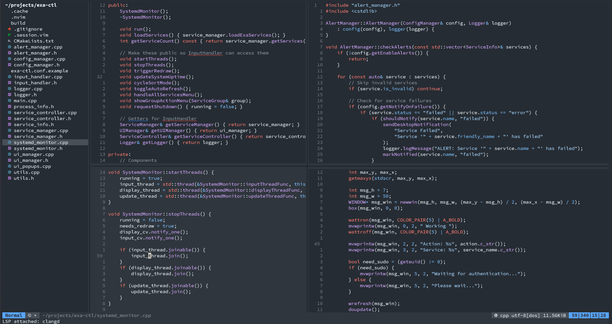
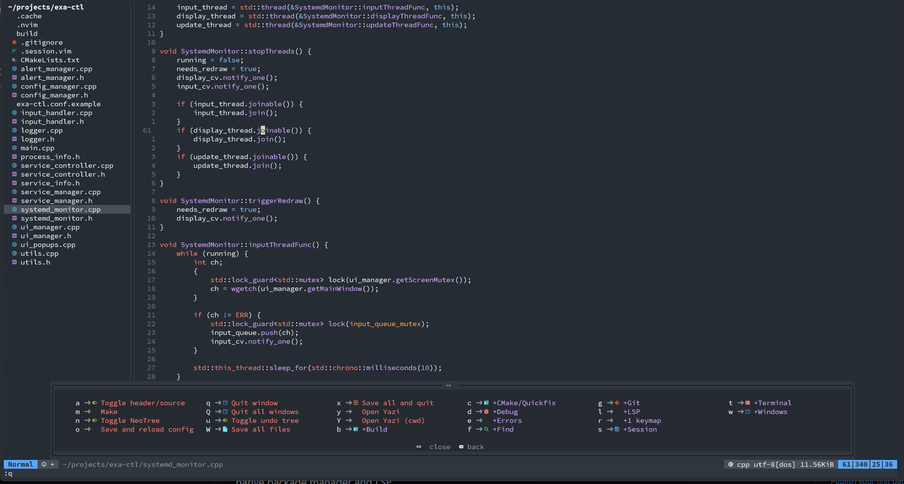
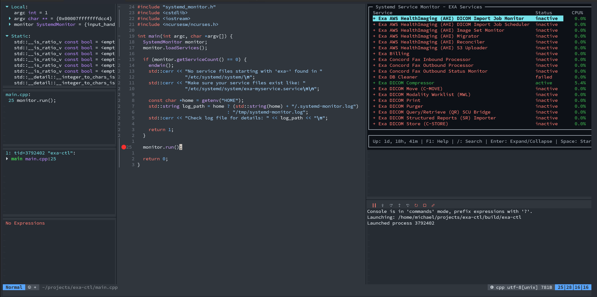

# Neovim C++ Development Configuration

A minimal, fast, and powerful Neovim configuration optimized for C++/CMake development using Neovim 0.12's native features.


*Full IDE setup with NeoTree, split windows, LSP diagnostics, and git integration*

---

## Table of Contents

- [Features](#features)
- [Quick Start](#quick-start)
- [Prerequisites](#prerequisites)
- [Installation](#installation)
- [Configuration Structure](#configuration-structure)
- [Keybindings](#keybindings)
- [Usage Examples](#usage-examples)
- [Settings Window](#settings-window)
- [Code Formatting](#code-formatting)
- [Project Root Detection](#project-root-detection)
- [Troubleshooting](#troubleshooting)
- [Architecture](#architecture)
- [Plugin List](#plugin-list)
- [Credits](#credits)

---

## Quick Start

**TL;DR - Get up and running in 5 minutes**:

```bash
# 1. Clone the repository
git clone https://github.com/mdmattsson/nvim-cpp ~/.config/nvim

# or use a symbolik link
# move your existing ~/.config/nvim to ~/.config/nvim_bak
git clone https://github.com/mdmattsson/nvim-cpp ~/.config/nvim-cpp
ln -s ~/.config/nvim-cpp ~/.config/nvim

# 2. Install LSP servers
cd ~/.config/nvim && chmod +x install_lsp.sh && ./install_lsp.sh

# 3. Add pip bin to PATH
echo 'export PATH="$HOME/.local/bin:$PATH"' >> ~/.bashrc
source ~/.bashrc

# 4. Start Neovim
nvim

# 5. Install Treesitter parsers (inside Neovim)
:TSInstall c cpp cmake bash lua javascript html css
```

**💡 Pro Tip**: Press `<Space>` and wait to see all available commands with **which-key**!

**First Steps After Installation**:
1. Open a C++ file: `nvim main.cpp`
2. Press `<Space>` - explore available commands
3. Try `<Space>S` - open the unified Settings window
4. Try `<leader>ff` - fuzzy find files
5. Try `gcc` - toggle comment on current line
6. Try `<leader>bc` - configure CMake

**[→ Skip to detailed installation](#installation)**

---

## Features

### Core Features
- **Native Package Management**: Uses Neovim 0.12's built-in `vim.pack.add()` - no external plugin managers needed
- **Built-in LSP**: Native Language Server Protocol support with autocompletion
- **Unified Settings Window**: Single interface for colorschemes, LSP management, and configuration
- **Modern Code Folding**: Beautiful, treesitter-based folding with nvim-ufo
- **Quick File Marks**: Lightning-fast navigation using Vim's built-in marks system
- **Treesitter Syntax Highlighting**: Advanced syntax highlighting and code understanding
- **Debugging (DAP)**: Full debugging support with GDB integration and persistent breakpoints
- **Git Integration**: Visual git diff markers, blame information, git status in file tree, and lazygit integration
- **Multiple File Explorers**: Oil.nvim, NeoTree, and Yazi for different workflows
- **Fuzzy Finding**: Fast file and text search with mini.pick
- **Which-Key**: Interactive keybinding popup to discover commands - press `<Space>` and wait!
- **Smart Build System**: Auto-detects executables, remembers your choices, with beautiful which-key menus
- **Flexible Terminal Options**: Run programs in split, fullscreen, floating, external, or tmux terminals
- **Automatic Session Management**: Saves and restores all windows, files, splits, and NeoTree state automatically
- **Active Window Highlighting**: Inactive windows are dimmed for easy visual identification
- **Project Root Detection**: Intelligent detection of project root for nested CMake projects
- **Code Formatting**: Configurable auto-format on save with clang-format integration
- **Live Colorscheme Preview**: See themes in real-time before applying

### Language Support
- **C/C++**: Full LSP support with clangd (completion, go-to-definition, diagnostics)
- **CMake**: LSP support for CMakeLists.txt files
- **Bash/Shell**: LSP support for shell scripts
- **Lua**: LSP support for Neovim configuration
- **JavaScript/TypeScript**: LSP support for web development
- **HTML/CSS**: LSP support for markup and styling
- **Rust**: LSP support (configurable)
- **Easy to extend**: Simple language configuration system

### Developer Tools
- **Auto-completion**: Intelligent code completion with auto-trigger
- **Diagnostics**: Real-time error and warning display
- **Code Actions**: Quick fixes and refactoring suggestions
- **Symbol Navigation**: Jump to definitions, declarations, references, implementations
- **Header/Source Toggle**: Quick switching between .h and .cpp files
- **Undo Tree**: Visual undo history with undotree
- **Comment Toggle**: Easy comment/uncomment with `gcc` and enhanced Comment.nvim
- **Auto-pairs**: Automatic bracket and quote closing
- **Project Root Detection**: Automatically changes to project root (works with nested projects)
- **Session Management**: Save and restore editing sessions
- **Persistent Breakpoints**: Debug breakpoints saved per-project
- **Multiple Terminal Modes**: Run in split, fullscreen, floating, external, or tmux terminals with auto-close on exit
- **LSP Toggle**: Enable/disable language servers per session with live restart

---

## Prerequisites

Before installing, make sure you have:

**Required**:
- Neovim 0.12 or later - `nvim --version`
- Git - `git --version`
- GCC/Clang - `gcc --version` or `clang --version`
- CMake - `cmake --version`
- Node.js and npm - `node --version` (for some LSP servers)
- Python 3 and pip - `python3 --version` (for CMake LSP)

**Optional but Recommended**:
- GDB - `gdb --version` (for debugging)
- Yazi - `yazi --version` (modern file manager)
- Lazygit - `lazygit --version` (git TUI)
- ripgrep - `rg --version` (faster grep for fuzzy finding)

**Check your system**:
```bash
# Quick check script
for cmd in nvim git gcc cmake node python3 gdb; do
    command -v $cmd >/dev/null 2>&1 && echo "✓ $cmd" || echo "✗ $cmd (missing)"
done
```

---

## Installation

1. **Clone this repository**:
```bash
git clone https://github.com/mdmattsson/nvim-cpp ~/.config/nvim
```

2. **Install LSP servers**:
```bash
cd ~/.config/nvim
chmod +x install_lsp.sh
./install_lsp.sh
```

The install script will:
- Detect your Linux distribution (Rocky/RHEL, Arch, or Ubuntu/Debian)
- Install clangd (C/C++ LSP)
- Install lua-language-server
- Install bash-language-server
- Install typescript-language-server (JavaScript/TypeScript)
- Install vscode-langservers-extracted (HTML/CSS)
- Install cmake-language-server (CMake)
- Optionally install Yazi file manager

3. **Add pip's bin directory to PATH** (for CMake LSP):
```bash
echo 'export PATH="$HOME/.local/bin:$PATH"' >> ~/.bashrc
source ~/.bashrc
```

4. **Configure git line endings** (recommended):
```bash
git config --global core.autocrlf input
git config --global core.eol lf
```

5. **Start Neovim**:
```bash
nvim
```

On first launch, Neovim will automatically download all plugins. Wait for the process to complete.

6. **Install Treesitter parsers** (in Neovim):
```vim
:TSInstall c cpp cmake bash lua javascript html css
```

---

## Configuration Structure

```
~/.config/nvim/
├── init.lua              # Main configuration file (single file!)
├── install_lsp.sh        # LSP server installation script
├── .gitignore            # Git ignore file
├── .gitattributes        # Git line ending configuration
├── README.md             # This file
└── screenshots/          # Screenshots for documentation
```

**Key Design Principles**:
- ✅ **Single file configuration** - Everything in `init.lua`
- ✅ **Native features** - Uses Neovim 0.12's built-in package manager and LSP
- ✅ **No plugin manager** - Direct use of `vim.pack.add()`
- ✅ **Unified keymap system** - One function (`map()`) for all keybindings
- ✅ **Project-aware** - Intelligent root detection for nested projects
- ✅ **Unified Settings** - Single window for all configuration options

---

## Keybindings

**Leader key**: `<Space>`

**💡 Discovery Tip**: Press `<Space>` and wait 300ms to see all available keybindings with **which-key**!


*Which-key popup showing all available commands organized by category*

### Basic Operations
| Keybinding | Description |
|------------|-------------|
| `<leader>w` | Save current file |
| `<leader>W` | Save all files |
| `<leader>q` | Quit current window |
| `<leader>Q` | Quit all windows |
| `<leader>x` | Save all and quit Neovim |
| `<leader>o` | Save and reload config |
| `<Esc>` | Clear search highlighting |

### Settings (`<leader>S`)
| Keybinding | Description |
|------------|-------------|
| `<leader>S` | **Open Settings window** |

**Inside Settings Window**:
- `j/k` or `↑/↓` - Navigate options
- `Enter` or `Space` - Select/Toggle option
- `q` or `Esc` - Back/Close
- `r` - Restart LSPs (in LSP view)

**Settings Options**:
- **Colorscheme** - Live preview and apply themes
- **LSP Servers** - Toggle language servers on/off
- **Auto-format** - Toggle auto-formatting on save

### Build & CMake (`<leader>b`)
| Keybinding | Description |
|------------|-------------|
| `<leader>bc` | **Configure** CMake (creates build/) |
| `<leader>bb` | **Build** project |
| `<leader>br` | **Build & Run** (with terminal picker) |
| `<leader>bt` | Run **tests** |
| `<leader>bp` | Show **project root** |
| `<leader>bP` | CD to **project root** |
| `<leader>cs` | **Clear** cached executable |
| `<leader>m` | Make |

### Debugging (`<leader>d`)
| Keybinding | Description |
|------------|-------------|
| `<F5>` | **Start/Continue** debugging |
| `<F9>` | Toggle **breakpoint** |
| `<F10>` | Step over (**next** line) |
| `<Shift-F10>` | **Step into** function |
| `<Shift-F11>` | Step out (**finish** function) |
| `<F6>` | **Restart** debugging |
| `<F8>` | **Stop** debugging |
| `<leader>dd` | **Start/Continue** debugging |
| `<leader>db` | Toggle **breakpoint** |
| `<leader>dB` | Clear all breakpoints |
| `<leader>dc` | **Continue** |
| `<leader>dq` | **Quit/Stop** debugging |
| `<leader>dr` | **Restart** debugging |
| `<leader>dn` | Step over (**next** line) |
| `<leader>ds` | **Step into** function |
| `<leader>df` | Step out (**finish** function) |
| `<leader>du` | Toggle DAP **UI** |
| `<leader>dl` | **List** all breakpoints |
| `<leader>dh` | **Hover**/evaluate expression |
| `<leader>dR` | Open **REPL** |
| `<leader>dX` | Delete persisted breakpoints file |

### LSP (Code Intelligence)
| Keybinding | Description |
|------------|-------------|
| `gd` | Go to definition |
| `gD` | Go to declaration |
| `gr` | Show references |
| `gi` | Go to implementation |
| `K` | Show hover documentation |
| `<leader>rn` | Rename symbol |
| `<leader>ca` | Code actions |
| `<leader>lf` | Format code (manual) |
| `<leader>lF` | **Toggle** auto-format on save |
| `[d` | Previous diagnostic |
| `]d` | Next diagnostic |
| `[e` | Previous error (errors only) |
| `]e` | Next error (errors only) |
| `<leader>e` | Show diagnostic float (single error) |
| `<leader>el` | Error list (current buffer) |
| `<leader>ew` | Error list (entire workspace) |

### File Navigation
| Keybinding | Description |
|------------|-------------|
| `-` | Open Oil file browser |
| `<leader>n` | Toggle NeoTree (git-aware file tree) |
| `<leader>y` | Open Yazi |
| `<leader>Y` | Open Yazi (current working directory) |
| `<leader>ff` | Find files |
| `<leader>fg` | Live grep (search in files) |
| `<leader>fw` | Find word under cursor |
| `<leader>fb` | Find buffers |
| `<leader>fo` | Find old files (recent) |
| `<leader>fl` | Find lines in current buffer |
| `<leader>fh` | Find help |

### Marks (Quick File Navigation) (`<leader>h`)
| Keybinding | Description |
|------------|-------------|
| `<leader>h1` | **Set** mark 1 |
| `<leader>h2` | **Set** mark 2 |
| `<leader>h3` | **Set** mark 3 |
| `<leader>h4` | **Set** mark 4 |
| `<leader>h5` | **Set** mark 5 |
| `<leader>1` | Jump to mark **1** |
| `<leader>2` | Jump to mark **2** |
| `<leader>3` | Jump to mark **3** |
| `<leader>4` | Jump to mark **4** |
| `<leader>5` | Jump to mark **5** |

### Code Folding (nvim-ufo)
| Keybinding | Description |
|------------|-------------|
| `zR` | Open **all** folds |
| `zM` | Close **all** folds |
| `za` | **Toggle** fold under cursor |
| `zo` | **Open** fold under cursor |
| `zc` | **Close** fold under cursor |
| `zK` | **Peek** fold or LSP hover |

### Comments
| Keybinding | Description |
|------------|-------------|
| `gcc` | Toggle comment on current line |
| `gc` | Toggle comment (visual mode) |
| `<leader>/` | Toggle comment (alternative) |
| `gbc` | Block comment |
| `gcO` | Comment above and enter insert |
| `gco` | Comment below and enter insert |
| `gcA` | Comment at end of line |

### Buffer Management
| Keybinding | Description |
|------------|-------------|
| `<Tab>` | Next buffer |
| `<Shift-Tab>` | Previous buffer |
| `<leader>bd` | Delete buffer |
| `<leader>bn` | Next buffer |
| `<leader>bp` | Previous buffer |

### Window Navigation
| Keybinding | Description |
|------------|-------------|
| `<C-h>` or `<C-Left>` | Move to left window |
| `<C-j>` or `<C-Down>` | Move to bottom window |
| `<C-k>` or `<C-Up>` | Move to top window |
| `<C-l>` or `<C-Right>` | Move to right window |
| `<C-Alt-Left>` | Create new split on the left |
| `<C-Alt-Right>` | Create new split on the right |
| `<C-Alt-Up>` | Create new split above |
| `<C-Alt-Down>` | Create new split below |
| `<leader>wh/l/k/j` | Create splits (alternative) |

### C++ Specific
| Keybinding | Description |
|------------|-------------|
| `<leader>a` | Toggle between header and source (.h ↔ .cpp) |

### Git
| Keybinding | Description |
|------------|-------------|
| `]c` | Next git hunk |
| `[c` | Previous git hunk |
| `<leader>gp` | Preview git hunk |
| `<leader>gb` | Git blame line |
| `<leader>gg` | Open lazygit (floating window) |
| `<leader>gG` | Open lazygit (fullscreen tab) |

### Quickfix List
| Keybinding | Description |
|------------|-------------|
| `<leader>co` | Open quickfix |
| `<leader>cc` | Close quickfix |
| `[q` | Previous quickfix item |
| `]q` | Next quickfix item |

### Session Management (`<leader>s`)
| Keybinding | Description |
|------------|-------------|
| `<leader>ss` | Save session manually |
| `<leader>sl` | Restore session manually |
| `<leader>sd` | Delete current session |
| `<leader>sf` | Find session |

**Note**: Sessions are automatically saved when you exit and restored when you reopen!

### Other Tools
| Keybinding | Description |
|------------|-------------|
| `<leader>u` | Toggle undo tree |
| `<leader>tt` | Open terminal |
| `<Esc><Esc>` | Exit terminal mode |
| `<C-q>` | Close terminal (in terminal mode) |

### Jump List
| Keybinding | Description |
|------------|-------------|
| `<C-o>` | Jump back |
| `<C-i>` | Jump forward |

---

## Usage Examples

This section shows practical workflows for common tasks.

### Your First C++ Project

1. **Create a CMake project**:
```bash
mkdir my_project && cd my_project
mkdir src build
touch CMakeLists.txt src/main.cpp
```

2. **Open in Neovim**:
```bash
nvim src/main.cpp
```

Neovim will automatically detect the project root!

3. **Configure CMake**:
```vim
<leader>bc
```

Creates `build/` and configures CMake with `compile_commands.json`.

4. **Build and run**:
```vim
<leader>br
```

- Builds automatically
- Shows executable picker (if multiple)
- Shows terminal picker (split/fullscreen/floating/external/tmux)
- Runs your program with auto-close on exit

5. **Start coding**:
- Type `std::` and see autocomplete
- Use `K` to view documentation
- Use `gd` to jump to definitions
- Use `<leader>lf` to format code

### Working with Nested CMake Projects

```
big_project/              ← Project root (auto-detected)
├── .git/
├── CMakeLists.txt        ← Top-level
├── build/                ← Build directory (created here)
├── src/
│   ├── CMakeLists.txt    ← Subdirectory
│   └── module1/
│       ├── CMakeLists.txt
│       └── main.cpp      ← Open from here, works perfectly!
└── tests/
```

**Open from any subdirectory**:
```bash
cd big_project/src/module1/
nvim main.cpp
```

Neovim will:
- Detect `big_project/` as project root
- Show: "Changed to project root: /path/to/big_project"
- Use `big_project/build/` for all build operations
- All commands work correctly!

### Using the Settings Window

Access all configuration in one place:

```vim
<leader>S    " Open Settings window
```

**Navigate the menu**:
- Use `j/k` or arrow keys to move
- Press `Enter` or `Space` to select

**Change colorscheme with live preview**:
```vim
<leader>S              " Open Settings
" Select 'Colorscheme'
" Navigate with j/k - see live preview!
" Press Enter to apply and save
" Press Esc to cancel
```

**Toggle LSP servers**:
```vim
<leader>S              " Open Settings
" Select 'LSP Servers'
" Use Space or Enter to toggle servers
" Press 'r' to restart all LSPs
" Press 'q' to go back
```

**Toggle auto-format**:
```vim
<leader>S              " Open Settings
" Select 'Auto-format'
" Toggles immediately
```

### Marks Workflow

Mark your most important locations:
```vim
" In main.cpp
<leader>h1    " Set mark 1

" In header.h
<leader>h2    " Set mark 2

" In tests.cpp
<leader>h3    " Set mark 3

" Now jump instantly:
<leader>1     " → main.cpp
<leader>2     " → header.h
<leader>3     " → tests.cpp
```

### Code Folding Workflow

```cpp
// Before (lots of functions)
class MyClass {
    void function1() { ... }
    void function2() { ... }
    void function3() { ... }
    void function4() { ... }
};

// After zM (fold all)
class MyClass { ... } 󰁂 20

// Navigate and open specific fold
/function3<Enter>
za    // Open just this fold

// Peek without opening
zK    // Shows fold contents in floating window
```

### Code Formatting Setup

Create `.clang-format` in your project root:
```bash
cd ~/my_project/
cat > .clang-format << EOF
BasedOnStyle: LLVM
IndentWidth: 4
ColumnLimit: 120
PointerAlignment: Left
EOF
```

Now your code auto-formats on save! Toggle with `<leader>lF` or in Settings (`<leader>S`).

### Debugging Workflow


*Active debugging session with breakpoints, DAP UI, and variable inspection*

1. **Set breakpoints**:
```vim
" Navigate to line
F9 or <leader>db    " Toggle breakpoint (shows 🔴)
```

2. **Start debugging**:
```vim
F5 or <leader>dd    " Start debugging
" DAP UI opens automatically
" Execution stops at breakpoint
```

3. **Debug commands**:
```vim
F10 or <leader>dn   " Step over (next line)
S-F10 or <leader>ds " Step into function
S-F11 or <leader>df " Step out of function
F5 or <leader>dc    " Continue to next breakpoint
F8 or <leader>dq    " Stop debugging
```

4. **Breakpoint persistence**:
- Breakpoints automatically save on exit
- Restored when you reopen the project
- Stored in `.nvim/breakpoints.json` (add to `.gitignore`)

### Session Management

Sessions automatically save and restore:
```bash
# Day 1
cd ~/my_project
nvim src/main.cpp
# Open multiple files, splits, NeoTree
<leader>x    # Exit (auto-saves session)

# Day 2
cd ~/my_project
nvim
# Everything restored exactly as you left it!
```

### Discovering Keybindings

```vim
<Space>          " Wait 300ms - see main menu
<Space>b         " See all Build commands
<Space>d         " See all Debug commands
<Space>f         " See all Find commands
<Space>h         " See all Marks commands
<Space>S         " Open Settings window
```

Which-key shows descriptions for every command!

---

## Settings Window

The unified Settings window (`<leader>S`) provides a single interface for all configuration options.

### Features

**Live Colorscheme Preview**:
- Navigate through themes with `j/k`
- See changes in real-time
- Press `Enter` to save
- Press `Esc` to cancel

**LSP Server Management**:
- Toggle individual language servers
- See installation status
- Restart all servers with `r`
- Changes persist across sessions

**Auto-format Control**:
- Toggle formatting on save
- Instant feedback
- Per-session setting

### Navigation

| Key | Action |
|-----|--------|
| `j/k` or `↑/↓` | Navigate options |
| `Enter` or `Space` | Select/Toggle |
| `q` | Back to previous menu |
| `Esc` | Cancel and return |
| `r` | Restart LSPs (in LSP view) |

### Adding New Settings

The Settings window is designed to be easily extensible. To add a new setting, edit the `settings_items` table in `init.lua`:

```lua
{
    name = "Your Setting Name",
    desc = "Description of what it does",
    action = function()
        -- Your setting logic here
    end
}
```

---

## Code Formatting

### Overview

The config includes smart auto-formatting powered by **clang-format**:
- ✅ Formats C/C++ files on save
- ✅ Only if `.clang-format` exists in project root
- ✅ Can be toggled with `<leader>lF` or Settings window
- ✅ Manual format with `<leader>lf`

### Quick Setup

**Quick start**:
```bash
cd ~/my_project/
echo "BasedOnStyle: LLVM" > .clang-format
```

**Common presets**:
- `LLVM` - LLVM/Clang style (default)
- `Google` - Google C++ Style Guide
- `Microsoft` - Visual Studio style
- `Mozilla` - Mozilla style
- `WebKit` - WebKit style
- `GNU` - GNU style

**Custom example**:
```yaml
BasedOnStyle: LLVM
IndentWidth: 4
ColumnLimit: 120
PointerAlignment: Left
BreakBeforeBraces: Attach
```

### Formatting Controls

| Action | Command |
|--------|---------|
| Toggle auto-format | `<leader>lF` or Settings window |
| Format file manually | `<leader>lf` |
| Format selection | Visual mode + `<leader>lf` |

**Disable formatting temporarily**:
```vim
<leader>lF    " Toggle OFF
" Make changes
:w            " Save without formatting
<leader>lF    " Toggle back ON
```

### Best Practices

1. **Commit .clang-format**:
```bash
git add .clang-format
git commit -m "Add clang-format configuration"
```

2. **Team consistency**: Everyone uses the same formatting automatically!

3. **Pre-commit hook** (optional):
```bash
# Format all staged files before commit
find . -name "*.cpp" -o -name "*.h" | xargs clang-format -i
```

---

## Project Root Detection

### How It Works

The config automatically finds your project root, even in complex nested structures. This is crucial for large CMake projects with multiple subdirectories.

**Detection priority** (highest to lowest):
1. `.git` directory
2. Existing `build/` directory
3. `.gitignore` file
4. `compile_commands.json`
5. Highest `CMakeLists.txt` in tree

### Why This Matters

**Works from any subdirectory**:
```bash
cd ~/big_project/src/module1/deep/nested/dir
nvim main.cpp
# Auto-changes to: ~/big_project/
# All commands use: ~/big_project/build/
```

**One session per project**:
- Not one per subdirectory
- Consistent behavior
- Clean session management

**Check project root**:
```vim
<leader>bp    " Show project root
<leader>bP    " CD to project root manually
```

---

## Troubleshooting

### Common Issues and Solutions

### LSP Not Starting

Check if the LSP server is installed:
```bash
which clangd
which lua-language-server
which bash-language-server
which cmake-language-server
```

Check LSP status in Neovim (in a C++ file):
```vim
:lua print(vim.inspect(vim.lsp.get_clients()))
```

You can also check and toggle LSP servers in the Settings window (`<leader>S`).

### No Autocompletion

1. Make sure you're in a C++ file (`.cpp`, `.h`)
2. Check if LSP attached: Look for "LSP attached: clangd" message
3. Open Settings (`<leader>S`) and verify clangd is enabled
4. Try manual completion: `<C-x><C-o>`

### Clangd Can't Find Headers

Create or update `compile_commands.json`:
```vim
<leader>bc    " This creates compile_commands.json
```

### CMake LSP Not Working

Make sure pip's bin is in PATH:
```bash
echo 'export PATH="$HOME/.local/bin:$PATH"' >> ~/.bashrc
source ~/.bashrc
```

Check if it's enabled in Settings (`<leader>S`).

### Build Directory Issues

If you have multiple `build/` directories:
1. Delete all nested `build/` directories
2. Reopen Neovim
3. Run `<leader>bc` to create a single `build/` at project root

### Colorscheme Not Persisting

The colorscheme should persist automatically when selected through the Settings window. If not:

1. Check if the file exists:
```vim
:echo readfile(stdpath('data') . '/current_colorscheme.txt')
```

2. Make sure you pressed `Enter` to save (not just `Esc`)

3. Try selecting again through Settings window (`<leader>S`)

### Folding Not Working

Make sure Treesitter is installed:
```vim
:TSInstall c cpp
```

Check fold settings:
```vim
:set foldlevel?    " Should be 99
:set foldenable?   " Should be ON
```

### Code Not Formatting

Check for `.clang-format`:
```bash
cd $(git rev-parse --show-toplevel)
ls -la .clang-format
```

If missing, create one:
```bash
echo "BasedOnStyle: LLVM" > .clang-format
```

Toggle auto-format in Settings (`<leader>S`) or with `<leader>lF`.

### Plugin Errors

Reinstall plugins:
```bash
rm -rf ~/.local/share/nvim/site/pack/
nvim  # Will redownload plugins
```

---

## Architecture

### Design Philosophy

This configuration is built on modern Neovim features:

**Core Technologies**:
- **Native package manager**: `vim.pack.add()` (Neovim 0.12+)
- **Native LSP**: `vim.lsp.enable()` and `vim.lsp.start()` (Neovim 0.12+)
- **Unified keymap system**: Single `map()` function for keybindings + which-key
- **Project-aware**: Intelligent root detection for nested CMake projects
- **Unified Settings**: Single window interface for all configuration

**Key Features**:
- ✅ Single-file config (everything in `init.lua`)
- ✅ ~30 plugins for full IDE functionality
- ✅ No external plugin manager needed
- ✅ Smart caching (remembers your choices)
- ✅ Which-key integration for discoverability
- ✅ Live preview for settings changes

---

## Plugin List

### By Category

### File Navigation
- **oil.nvim** - Edit directories like buffers
- **neo-tree.nvim** - Git-aware file tree
- **yazi.nvim** - Terminal file manager integration
- **mini.pick** - Fuzzy finder

### UI & Appearance
- **mini.statusline** - Minimal statusline
- **which-key.nvim** - Keybinding hints
- **nvim-web-devicons** - File icons
- **nvim-ufo** - Modern code folding
- **nui.nvim** - UI components

### Editing
- **Comment.nvim** - Smart commenting
- **nvim-autopairs** - Auto-close brackets
- **undotree** - Visual undo history
- **nvim-treesitter** - Syntax highlighting

### LSP & Completion
- Native Neovim LSP
- Native completion

### Git
- **gitsigns.nvim** - Git diff in gutter
- **lazygit** integration

### Build Tools
- **cmake-tools.nvim** - CMake integration

### Debugging
- **nvim-dap** - Debug Adapter Protocol
- **nvim-dap-ui** - Debug UI
- **nvim-dap-projects** - Project-specific debug configs
- **nvim-nio** - Async I/O for DAP

### Session Management
- **auto-session** - Automatic session save/restore

### Colorschemes
- **tokyonight**, **vague**, **visual_studio_code**, **onedark**, **github-theme**

---

## Adding to .gitignore

Add these to your project's `.gitignore`:

```gitignore
# Build directory
/build/

# Neovim project files
/.nvim/

# Session files (if using manual sessions)
.session.vim

# Do NOT ignore .clang-format - it should be committed!
```

---

## Credits

- Neovim team for the amazing editor
- Plugin authors (see plugin list above)
- clangd team for the excellent C++ language server
- Yazi team for the blazing-fast file manager
- Which-key team for the beautiful menu system
- Lazygit team for the excellent git TUI
- nvim-ufo team for modern folding

---

## License

This configuration is provided as-is under the MIT License. Feel free to use, modify, and distribute.

---

## Support

**Need Help?**

1. Check the [Troubleshooting](#troubleshooting) section
2. Review Neovim documentation: `:help` inside Neovim
3. Check individual plugin documentation
4. Open an issue at https://github.com/mdmattsson/nvim-cpp

**Resources**:
- [Neovim Documentation](https://neovim.io/doc/)
- [clangd Documentation](https://clangd.llvm.org/)
- [CMake Documentation](https://cmake.org/documentation/)

---

**💡 Final Reminder**: Press `<Space>` in Neovim to discover all available commands with which-key, or press `<Space>S` to open the unified Settings window! 🚀